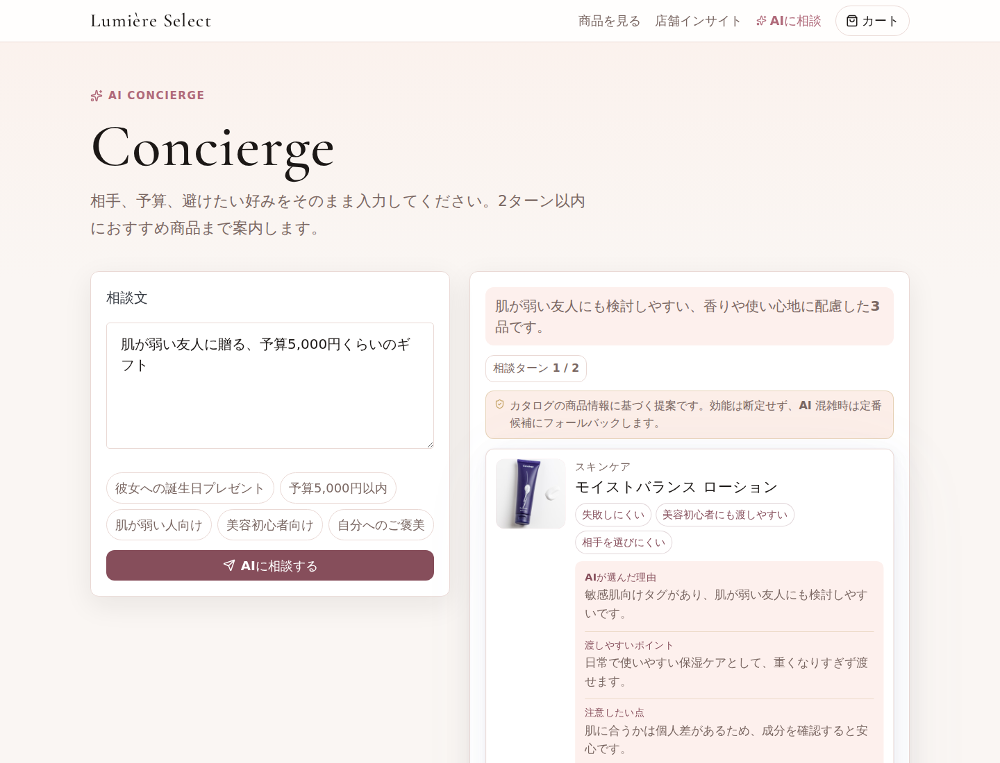
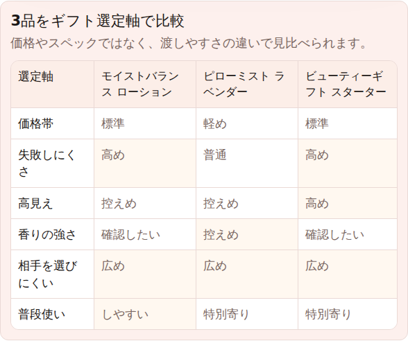
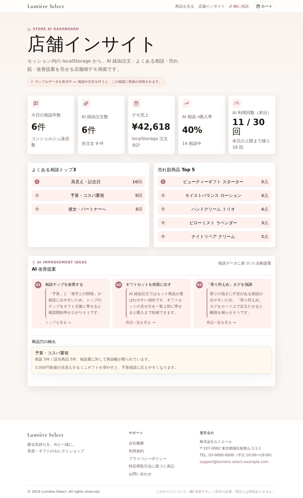

# Lumiere Select

AI を業務導線に組み込む実装力を見せるための、EC 購買支援アプリです。

「肌が弱い友人に贈るギフトが分からない」のような曖昧な相談を、AI が商品提案・比較軸・購入理由・店舗改善インサイトに変換します。単なるチャット UI ではなく、LLM の回答を商品 ID、理由、注意点、比較、注文導線に接続し、AI が失敗しても業務フローが止まらないように設計しています。

公開URL: <https://lumiere-select.pages.dev>

## 営業で見せたいポイント

- ユーザーの自然文相談を、購入判断に使える 3 商品へ絞り込む
- LLM の回答をそのまま出さず、商品 ID に接地して理由・注意点・相手条件へ正規化する
- 3 品比較、商品詳細への相談文脈引き継ぎ、ギフト添え書き生成まで購買フローに接続する
- 店舗側には相談傾向、AI 経由注文、売れ筋、商品穴検出を見せる
- DeepSeek API キーは Supabase Edge Functions 側に閉じ、ブラウザへ露出しない
- フォールバックと E2E テストで、AI/API 不調時も主要導線が壊れないことを確認する

## スクリーンショット

### AI 相談



### 3 品比較



### 店舗インサイト



## 主な機能

### AI ギフトコンシェルジュ

予算・相手・シーンを自然文で入力すると、AI が 36 品のカタログから渡しやすい 3 品を提案します。各カードには「AI が選んだ理由」「渡しやすいポイント」「注意したい点」「合いそうな相手」を分けて表示します。

### 追加質問と再提案

AI が追加質問を出し、ユーザーはチップまたは自由入力で回答できます。2 ターン以内で条件を絞り直し、相談の解決まで付き合う体験にしています。

### 3 品比較と詳細引き継ぎ

提案された 3 品を、価格帯・失敗しにくさ・高見え・香りの強さ・相手を選びにくいか、というギフト選定軸で比較できます。商品詳細へ進むと、直近相談の理由も引き継がれます。

### 商品一覧の AI リランキング

商品一覧で「彼女 高見え 保湿」のように入力すると、AI が候補商品をおすすめ順に並べ替えます。

### 注文後のギフト添え書き生成

注文完了画面で、相談内容と商品名をもとにギフトに添える一言を生成できます。

### 店舗インサイト

`/admin-demo` では、相談件数、AI 経由注文数、売れ筋、相談トピック、商品穴検出を表示します。実績がない初回表示では、営業デモで画面が空にならないよう表示専用サンプルデータへフォールバックします。

## AI 実装上の工夫

| 工夫 | 内容 |
|---|---|
| 商品 ID 接地 | AI には候補カタログを渡し、返答は候補内の商品 ID のみに制限。無効 ID はクライアント側でも除外します。 |
| フォールバック | DeepSeek API エラー、JSON パース失敗、通信失敗時も定番候補や通常順を返し、購入導線を維持します。 |
| 回答正規化 | `recommendations` を `productId + reason + easyToGive + caution + fitFor` に正規化し、理由と商品がズレないようにしています。 |
| 利用回数制限 | ブラウザ単位で AI 利用回数を日次制限し、上限値が変わった場合は旧カウントを自動リセットします。 |
| E2E テスト | Playwright で相談、無効 ID 除外、再提案、3 品比較、詳細引き継ぎ、注文完了、添え書き生成、管理画面反映を検証します。 |

## 技術スタック

| レイヤー | 技術 |
|---|---|
| フロントエンド | React 19 + Vite 8 |
| UI | Pico.css + 独自 CSS + Motion + View Transitions |
| AI Gateway | Supabase Edge Functions |
| AI | DeepSeek API |
| ホスティング | Cloudflare Pages |
| 状態管理 | localStorage / sessionStorage |
| テスト | Playwright / oxlint |

## セットアップ

```bash
make setup
make dev
make build
cd app && npx playwright test
```

`DEEPSEEK_API_KEY` / `DEEPSEEK_MODEL` は Supabase Secrets に置きます。ブラウザには公開しません。AI 呼び出しが未設定または失敗しても、フォールバックで主要導線は動作します。

## ディレクトリ構成

```text
.
├── app/                           # React + Vite SPA
│   ├── src/
│   │   ├── data/                  # 商品カタログ、管理画面サンプルデータ
│   │   ├── lib/                   # cart / aiLimit / giftLabels / supabase
│   │   └── pages/                 # Top / Products / Concierge / AdminDemo など
│   └── e2e/                       # Playwright E2E
├── supabase/functions/
│   ├── concierge/                 # AI ギフト相談、添え書き生成
│   └── recommend-products/        # AI リランキング
├── docs/assets/screenshots/       # README 用スクリーンショット
├── env/config.yaml                # 非機密設定
└── docs/                          # 要件、設計、タスク管理
```

## ドキュメント

- [`docs/01_requirements.md`](docs/01_requirements.md) - 目的・ユースケース・制約
- [`docs/02_architecture.md`](docs/02_architecture.md) - 構成・Edge Function I/O・設計境界
- [`docs/07_test_strategy.md`](docs/07_test_strategy.md) - テスト方針
- [`docs/tasks/backlog/00-roadmap.md`](docs/tasks/backlog/00-roadmap.md) - 実装ロードマップ
